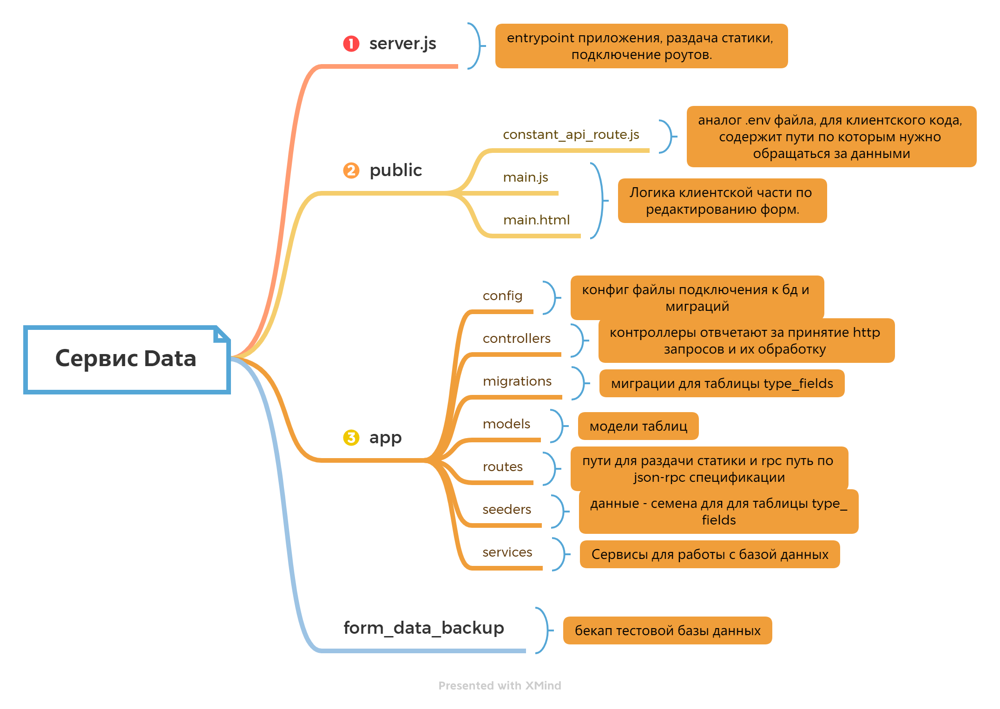

# 1 часть тестового задания, сервис data (api).

> [Деплой на heroku](https://vast-reaches-02528.herokuapp.com)

# Описание 

> Сервис data (api), для работы с сервисом site.
> Взаимодействие с api, спецификация JSON-RPC 2.0 (без batching, notifications).
> Взаимодействие с сервисом site, редактирование формы - название формы и уникальный form_uid формы, редактирование полей формы, создание и удаление полей.
> Реализовано как небольшое ssr с раздачей статики через express static.

# Тех. стек

> ExpressJS, Sequelize ORM, PostgreSQL, JS, HTML, CSS

# Xmind схема структуры проекта

# Локальный деплой

> Перед развертыванием, убедитесь что указаны правильные конфиг переменные app/config/config.js (миграции, сиды), app/config/db.config.js (подключение sequelize к бд).
> Для развертывания с помощью докера, в конфигах закомментированы переменные, для локального деплоя, без помощи докера - переменную host нужно сменить на localhost.
> С помощью docker-compose: введите в терминал из корневой папки `docker-compose up --build -d`, сервис будет доступен по адресу http://localhost:3001, так же замените api роуты в файле public/constant_api_route.js на локальные.
> С помощью yarn: 
- `yarn`
- `npx sequelize-cli db:migrate`
- `npx sequelize-cli db:seed:all`
- `yarn dev`
> сервис будет доступен по адресу http://localhost:3001, так же замените api роуты в файле public/constant_api_route.js на локальные.

## Тестовый дамп базы данных

> form_data_backup - custom format